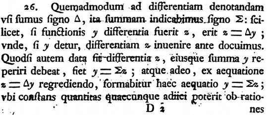

## Index variables (i, j, k, …)

TLDR: First used—or at least popularized—by Fourier.

### Fortran

Many people state that Fortran is is the reason that the *ijk* variables are so popular in programming languages. Here's a snippet from the *[Fortran Automatic Coding System for the IBM 704](http://www.fh-jena.de/~kleine/history/languages/FortranAutomaticCodingSystemForTheIBM704.pdf)* manual:

In Fortran ([at least in 1957](https://web.archive.org/web/20150812002400/http://archive.computerhistory.org/resources/text/Fortran/102663113.05.01.acc.pdf)), integers are primarily used to index, not to calculate:

> Integer quantities are somewhat restricted in their use and serve primarily as subscripts or exponents.

This leads us to look further back, for a mathematical source.

### Mathematics

The most common place (at least for non-mathematicians) to see *ijk* in mathematics is probably with *sigma notation*, when using the summation operator Σ.

Florian Cajori’s *A History of Mathematical Notations* states that Σ was first used by Euler, in *[Institutiones calculi differentialis](http://books.google.co.nz/books?id=sYE_AAAAcAAJ)* (1755).

This reads (translation by [Ian Bruce](http://www.17centurymaths.com/)):

> 26. Just as we have been accustomed to specify the difference by the sign Δ, thus we will indicate the sum by the sign Σ; evidently if the difference of the function <i>y</i> were <i>z</i>, there will be <i>z</i> = Δ<i>y</i>; from which, if <i>y</i> may be given, the difference <i>z</i> is found we have shown before. But if moreover the difference <i>z</i> shall be given and the sum of this <i>y</i> must be found, <i>y</i> = Σ<i>z</i> is made and evidently from the equation <i>z</i> = Δ<i>y</i> on regressing this equation will have the form <i>y</i> = Σ<i>z</i>, where some constant quantity can be added on account of the reasons given above; []

This doesn’t seem to be the Σ we’re looking for, as Euler uses it only in opposition to Δ (for finite differencing). In fact, Cajori notes that Euler’s Σ received little attention, and it seems that only Lagrange adopted it. Here is an excerpt from his *[Œuvres](http://www.archive.org/details/oeuvrespublies03lagruoft)* (printed MDCCCLXIX):

Again, we can see Σ is only used in opposition to Δ. Cajori next states that Σ to mean sum was used by Fourier, in his *[Théorie Analytique de la chaleur](http://www.archive.org/details/thorieanalytiq00four)* (1822), and here we find what are looking for:

> The sign Σ affects the number <i>i</i> and indicates that the sum must be taken from <i>i</i>=1 to <i>i</i>=1/0. One can also contain the first term 1 under the sign Σ, and we have: [equation]
> 
> It must then have all its integral values from -1/0 up to 1/0; that is what one indicates by writing the limits -1/0 and +1/0 next to the sign Σ, that one of the values of <i>i</i> is 0. This is the most concise expression of the solution.

Since Fourier explains Σ several times in the book and not just once, we can assume that the notation is either new or unfamiliar to most readers. In any case, it doesnt really matter who invented it, because while we have found our Σ, Fourier doesnt explain why he uses *i*. In fact, since he uses it to index sequences in other places it appears it must be an already-existing usage.

A quick skim of the text by Euler above shows that he uses indexing very rarely (despite the subject of the text being a prime candidate!), and when he does, he uses *m*.

TBC!
